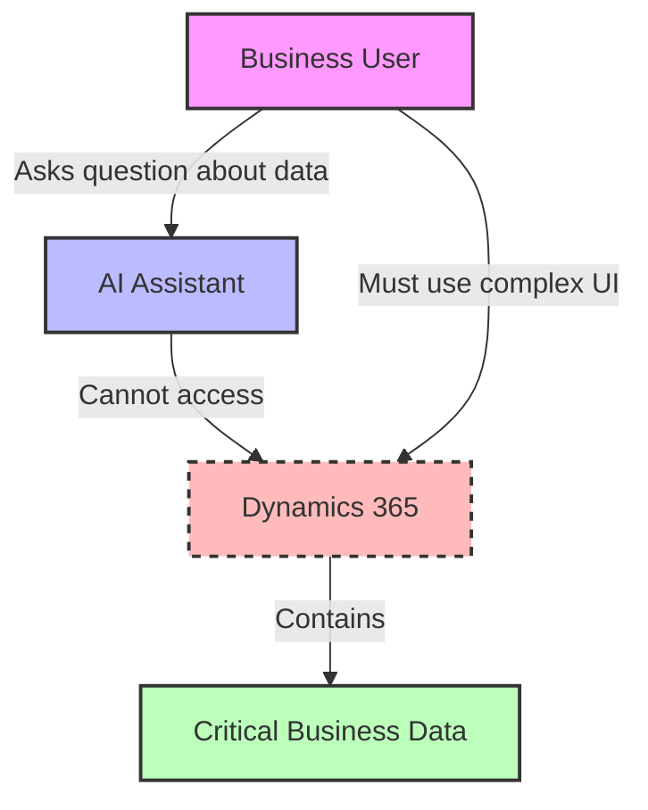
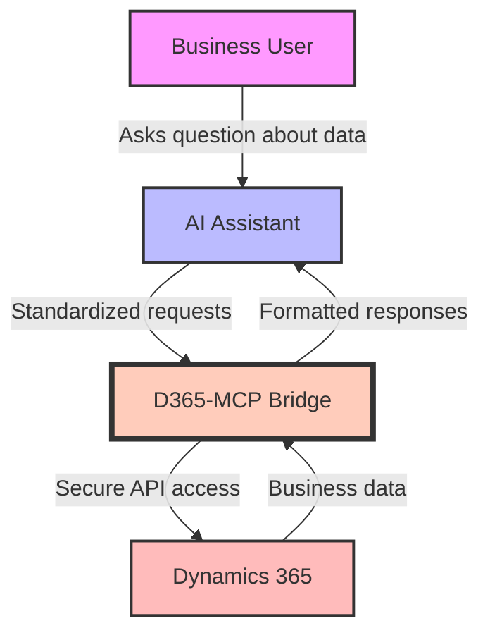
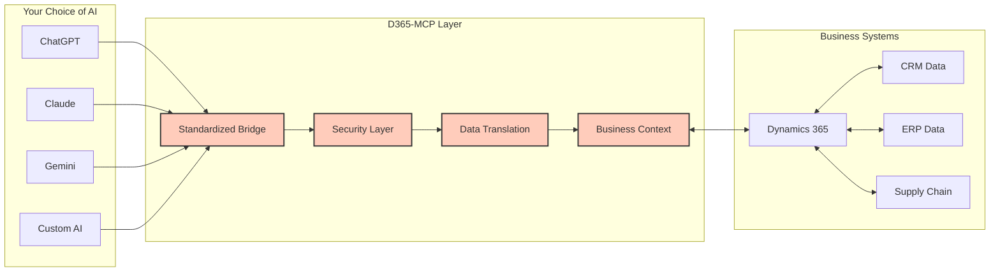
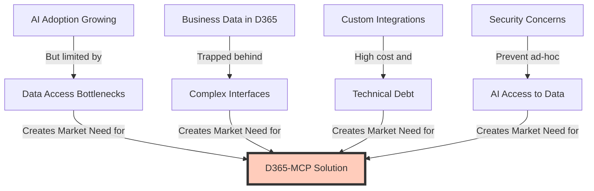

# D365-MCP: Unlocking Business Data for AI

## The Problem We Solve

Today's organizations face a critical challenge: valuable business data is locked inside complex systems like Dynamics 365, while AI assistants can't easily access this information.

Without standardization, each organization must build custom connectors for every AI system they want to use, creating:

- **High development costs** for each AI integration
- **Technical barriers** that prevent business users from leveraging AI
- **Siloed information** that limits AI effectiveness
- **Security vulnerabilities** from inconsistent implementation approaches

## Our Solution: A Universal Bridge

D365-MCP creates a standardized bridge between any AI system and Dynamics 365, unlocking business data with natural language.

### Key Benefits

- **Speak to your business data** without technical knowledge
- **Use any AI platform** - works with ChatGPT, Claude, Gemini, or custom AI
- **No single vendor lock-in** for your AI strategy
- **Enterprise-grade security** for sensitive business information
- **Rapid deployment** with minimal development costs

### How It Works

D365-MCP is not another AI assistant—it's the essential layer that lets ANY AI system intelligently work with your business data.

## Why Businesses Need This Now

Organizations face increasing pressure to leverage AI for competitive advantage while managing complex business systems like Dynamics 365. Our solution arrives at this critical intersection, providing immediate value by:

- **Democratizing Access**: Enabling every employee to access business insights without technical expertise
- **Reducing IT Burden**: Eliminating expensive custom integration projects for each AI system
- **Future-Proofing**: Creating flexibility to adopt any current or future AI platform
- **Accelerating AI ROI**: Delivering immediate business value from existing D365 investments

## Investment Opportunity

- [Executive Summary](docs/1-executive-summary/executive-summary.md): The business case for D365-MCP
- [Market Analysis](docs/2-market-opportunity/market-analysis.md): $500M+ addressable market in Dynamics ecosystem
- [Product Vision](docs/3-product-vision/solution-architecture.md): Universal bridge architecture
- [Business Model](docs/4-business-model/monetization-strategy.md): Tiered SaaS pricing with partner ecosystem
- [Go-to-Market](docs/5-go-to-market-strategy/go-to-market-plan.md): Microsoft partner channel strategy
- [Team](docs/6-team/team-structure.md): Deep expertise in D365, AI, and enterprise SaaS
- [Financials](docs/7-financial-plan/financial-projections.md): $7.3M revenue by Year 3
- [Risk Analysis](docs/8-risk-analysis/risk-assessment.md): Comprehensive mitigation strategies
- [Timeline](docs/9-implementation-timeline/development-roadmap.md): 12-month roadmap to market
- [Conclusion](docs/10-conclusion/conclusion.md): The opportunity ahead

## Join Us in Transforming Business AI

By standardizing the connection between AI and business applications, D365-MCP creates a scalable platform that:
- Solves an urgent market need
- Leverages the rapidly growing AI adoption trend
- Creates sustainable competitive advantage
- Delivers compelling ROI for customers and partners

**[Contact us](mailto:contact@d365-mcp.com)** to learn more about partnership and investment opportunities.
