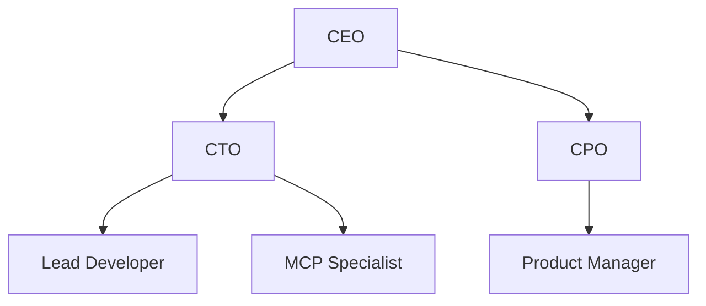
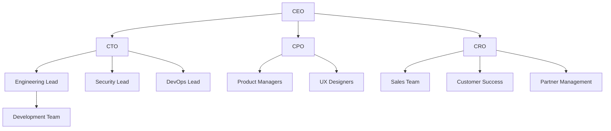
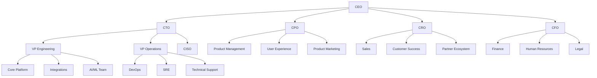

# Team

## Founding Team and Experience

The D365-MCP initiative requires a multidisciplinary founding team with expertise spanning Dynamics 365, AI/LLM technologies, cloud architecture, and SaaS business development. The ideal founding team composition includes:

### Leadership Roles

- **Chief Executive Officer**: Responsible for overall business strategy, fundraising, and stakeholder relationships
  - Background: SaaS business leadership, preferably with enterprise software experience
  - Key skills: Strategic vision, go-to-market planning, investor relations

- **Chief Technology Officer**: Responsible for technical architecture, product roadmap, and engineering leadership
  - Background: Cloud architecture, AI/ML implementation, distributed systems
  - Key skills: Technical leadership, architecture design, AI/LLM expertise

- **Chief Product Officer**: Responsible for product vision, user experience, and feature prioritization
  - Background: Product management in enterprise software, preferably Dynamics 365
  - Key skills: Product strategy, market research, user experience design

- **Chief Revenue Officer**: Responsible for sales strategy, partner ecosystem, and revenue growth
  - Background: Enterprise software sales, Microsoft partner ecosystem experience
  - Key skills: Sales leadership, channel development, partnership management

### Technical Leadership

- **Lead Architect**: Designs the core platform architecture and technology decisions
  - Background: Cloud-native architectures, multi-tenant SaaS platforms
  - Key skills: Azure expertise, security design, scalable architecture

- **AI/ML Engineering Lead**: Drives the AI capabilities and LLM integration
  - Background: LLM implementation, prompt engineering, AI application design
  - Key skills: AI model integration, prompt optimization, context management

- **Dynamics 365 Specialist**: Provides deep expertise in D365 integration and customization
  - Background: D365 development, OData API experience, Power Platform
  - Key skills: D365 technical knowledge, API integration, business process expertise

- **Security & Compliance Lead**: Ensures the platform meets enterprise security requirements
  - Background: Cloud security, compliance frameworks, IAM
  - Key skills: Security architecture, compliance management, data protection

## Key Hires Needed

As the organization grows, critical early hires will include:

### Technical Roles

1. **MCP Server Developers**: Specialists in implementing MCP servers and integration patterns
   - Skills: TypeScript/Node.js, API design, protocol implementation

2. **Full Stack Developers**: Implementing client applications and admin interfaces
   - Skills: React/Angular, Node.js, responsive design, accessibility

3. **DevOps Engineers**: Building the CI/CD pipeline and operational infrastructure
   - Skills: Infrastructure as code, Azure DevOps, monitoring, container orchestration

4. **QA Engineers**: Ensuring platform quality and reliability
   - Skills: Automated testing, performance testing, security testing

### Business Roles

1. **Partner Success Managers**: Enabling and supporting implementation partners
   - Skills: Technical consulting, relationship management, training delivery

2. **Product Marketing Manager**: Creating compelling positioning and content
   - Skills: B2B marketing, technical content creation, product messaging

3. **Customer Success Managers**: Ensuring successful customer implementation and adoption
   - Skills: Project management, stakeholder management, training delivery

4. **Solution Architects**: Supporting complex customer implementations
   - Skills: D365 expertise, integration design, solution planning

## Advisory Board

An advisory board with expertise in key areas will provide strategic guidance:

1. **Microsoft Ecosystem Expert**: Providing insight into Microsoft's strategy and partner ecosystem
   - Background: Current or former Microsoft executive with D365 knowledge

2. **AI/LLM Subject Matter Expert**: Advising on AI strategy and implementation
   - Background: AI researcher or executive with enterprise application experience

3. **Enterprise SaaS Founder**: Guiding SaaS business model and scaling strategy
   - Background: Successful B2B SaaS founder, preferably in enterprise software

4. **Vertical Industry Leaders**: Providing domain expertise for key target industries
   - Background: Industry executives with deep domain knowledge

## Organizational Structure

The organizational structure will evolve as the company grows:

### Initial Structure (1-10 employees)

### Growth Structure (11-30 employees)

### Scale Structure (31+ employees)

## Development Culture and Values

The team will operate with the following cultural principles:

1. **Customer-centricity**: Deeply understanding customer needs drives all decisions
2. **Technical excellence**: Maintaining high standards for code quality and architecture
3. **Agile delivery**: Iterative development with continuous customer feedback
4. **Ownership mindset**: Team members take end-to-end responsibility for outcomes
5. **Collaborative innovation**: Fostering cross-functional collaboration and creativity
6. **Data-driven decisions**: Using metrics and evidence to guide product development
7. **Continuous learning**: Investing in skill development and knowledge sharing
