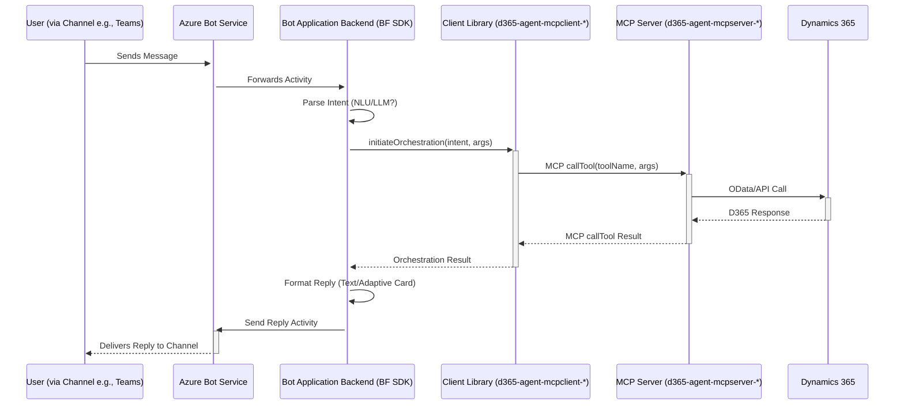

# Microsoft Bot Framework Integration

The **Microsoft Bot Framework** provides a comprehensive platform for building, connecting, deploying, and managing enterprise-grade conversational AI experiences across various channels. Integrating with Bot Framework allows users to interact with the Dynamics 365 AI Agent system through familiar interfaces like Microsoft Teams or embedded web chat.

## Role in Architecture

*   **Presentation Layer:** Represents channels like Microsoft Teams, Web Chat (via Direct Line or Azure Bot Service channel), and potentially others (Slack, SMS via Twilio channel, etc.).
*   **Application Backend Layer:** The core logic of the bot, built using the Bot Framework SDK, acts as an instance of the Application Backend. It handles incoming messages, manages conversation state, orchestrates tasks, and sends replies.

## Key Components

*   **SDK Source Code:** Note that the `submodules/botframework-sdk` repository mainly contains documentation, schemas, and tools. The actual language-specific SDK source code resides in separate repositories: [`microsoft/botbuilder-dotnet`](https://github.com/microsoft/botbuilder-dotnet) (`submodules/botbuilder-dotnet`) for C#/.NET and [`microsoft/botbuilder-js`](https://github.com/microsoft/botbuilder-js) (`submodules/botbuilder-js`) for JavaScript/TypeScript.
*   **Core Components:**
    *   **Channels:** The user interacts via a supported Bot Framework channel (e.g., Teams, Web Chat).
    *   **Azure Bot Service:** Acts as the central relay and management service for the bot. It receives messages from the channel and forwards them to the bot's backend logic.
    *   **Bot Application Backend:** This is the core logic of the bot and serves as the **Application Backend** in our architecture. It is built using one of the Bot Framework SDKs and hosted on Azure compute (e.g., App Service, Functions, Container Apps). It:
        *   Receives incoming activities (messages, events) from Azure Bot Service.
        *   Manages conversation state (using Bot Framework state APIs or external stores).
        *   Integrates the appropriate D365 AI Agent **Client Library** ([`d365-agent-mcpclient-dotnet`](https://github.com/ntrtd/d365-agent-mcpclient-dotnet) or [`d365-agent-mcpclient-ts`](https://github.com/ntrtd/d365-agent-mcpclient-ts)) for orchestration.
        *   Sends outgoing activities (replies) back through Azure Bot Service to the channel.

## Integration Flow

1.  User sends a message via a channel (e.g., Teams).
2.  Azure Bot Service routes the activity to the Bot Application Backend's messaging endpoint.
3.  The Bot Application Backend (built with Bot Framework SDK) receives the activity.
4.  It potentially uses NLU services (LUIS, CLU, LLM) or simple parsing to determine user intent.
5.  It invokes the orchestration logic within the integrated **`d365-agent-mcpclient-*`** library (using AutoGen/DAG).
6.  The orchestration logic calls necessary tools on the deployed **`d365-agent-mcpserver-*`** via MCP.
7.  The orchestration logic receives results or status updates from the MCP Server.
8.  The Bot Application Backend formats a user-friendly response (text, Adaptive Cards, etc.).
9.  The Bot Application Backend sends the response activity back to the user via the Azure Bot Service and the channel.

## Strengths
    *   **Multi-Channel Support:** Build once, deploy to multiple channels like Teams, Web Chat.
    *   **Enterprise Grade:** Robust platform with features for state management, authentication (integrates with Entra ID), scalability, and tooling.
    *   **Rich UI (Teams):** Supports Adaptive Cards for displaying structured information and gathering input within Teams.
    *   **Mature SDKs:** Well-documented SDKs available for both .NET and Node.js.

*   **Considerations:** Primarily focused on conversational interfaces. Less suited for deeply embedding AI assistance within a complex, non-chat application UI compared to CopilotKit.
