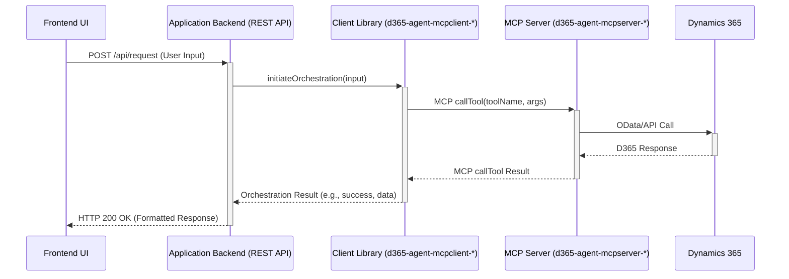

# Standard Client-Server Integration

This pattern represents the most traditional approach for connecting a frontend UI to the Application Backend.

*   **Frontend (UI):** Can be built using any preferred web framework (React, Angular, Vue, Blazor, etc.), mobile framework (React Native, Swift, Kotlin), or desktop framework.
*   **Communication:** The frontend interacts with its corresponding **Application Backend** using standard, well-defined protocols. Common choices include:
    *   **REST APIs:** Frontend makes HTTP requests (GET, POST, PUT, DELETE) to endpoints exposed by the Application Backend. Suitable for request-response interactions.
    *   **WebSockets / SignalR:** For real-time, bidirectional communication. Useful for streaming responses from the AI or pushing notifications from the backend.
*   **Backend Responsibility:**
    *   Exposes the API endpoints (REST or WebSocket/SignalR hubs) consumed by the frontend.
    *   Handles user authentication and authorization.
    *   Manages user/session state.
    *   Receives requests from the frontend.
*   Uses the appropriate `d365-agent-mcpclient-*` library to orchestrate the required business logic by calling the `d365-agent-mcpserver-*` via MCP.
*   Formats results or streams responses back to the frontend over the chosen communication protocol.

## Interaction Flow Example (REST API)

**(Note:** For WebSockets/SignalR, the flow would involve establishing a connection first, and the final response would be pushed from AB to FE over the persistent connection.)**

## Use Cases
*   Integrating AI chat capabilities into existing applications built with various frameworks.
*   Mobile applications needing to interact with the D365 agent backend.
*   Situations where frameworks like CopilotKit or Vercel AI SDK are not desired or applicable.

**Considerations:** Requires defining the API contract between the frontend and backend. Less "magical" than frameworks like CopilotKit regarding frontend context awareness or actions, requiring more manual implementation for such features.
