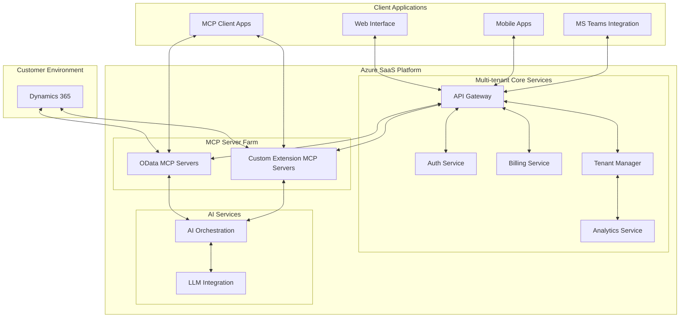
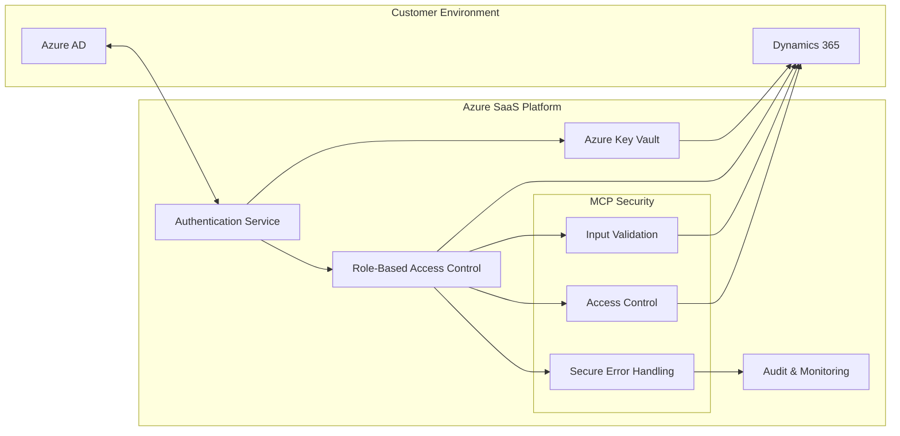

# AI Interface to Dynamics Business Applications
## Leveraging Model Context Protocol on Azure

## Executive Summary

This proposal outlines a strategy to create and monetize an AI interface for Dynamics 365 business applications using the Model Context Protocol (MCP). The solution will be deployed as a multi-tenant SaaS application on Azure, allowing customers to connect their Dynamics environments through a secure onboarding process. The integration will support both standard D365 OData interfaces and custom application extensions for enhanced capabilities.

## Business Opportunity

Organizations using Dynamics 365 face challenges in efficiently accessing, analyzing, and working with their business data. An AI interface can transform how users interact with these systems by:

1. Enabling natural language queries of business data
2. Automating routine operations and workflows
3. Providing intelligent insights and recommendations
4. Simplifying complex business processes
5. Making Dynamics data accessible to non-technical users

## Solution Architecture

### Overview

The proposed solution follows a layered architecture:



### Key Components

1. **Multi-tenant Core Services**
   - API Gateway: Central access point for all client applications
   - Auth Service: Handles authentication and authorization
   - Tenant Manager: Manages customer environments and configurations
   - Billing Service: Handles subscription management and usage tracking
   - Analytics Service: Monitors usage patterns and performance

2. **MCP Server Farm**
   - OData MCP Servers: Connect to standard Dynamics OData endpoints
   - Custom Extension MCP Servers: Connect to custom Dynamics extensions

3. **AI Services**
   - LLM Integration: Connects to AI models (Claude, GPT-4, etc.)
   - AI Orchestration: Manages context, prompts, and tool invocation

4. **Client Applications**
   - Web Interface: Primary user interface
   - Mobile Apps: For on-the-go access
   - MS Teams Integration: Embedded experience in Teams
   - MCP Client Apps: Support for direct MCP client connections

## MCP Implementation Details

### OData MCP Server

The OData MCP Server will expose Dynamics data and operations through MCP resources and tools:

```typescript
// Example tool definitions for Dynamics OData
{
  name: "query_entity",
  description: "Query a Dynamics entity set with OData parameters",
  inputSchema: {
    type: "object",
    properties: {
      entitySet: { type: "string" },
      queryParams: { 
        type: "object",
        properties: {
          $select: { type: "string" },
          $filter: { type: "string" },
          $expand: { type: "string" },
          $orderby: { type: "string" },
          $top: { type: "number" },
          $skip: { type: "number" }
        }
      }
    },
    required: ["entitySet"]
  }
}

{
  name: "create_record",
  description: "Create a new record in a Dynamics entity set",
  inputSchema: {
    type: "object",
    properties: {
      entitySet: { type: "string" },
      record: { type: "object" }
    },
    required: ["entitySet", "record"]
  }
}

{
  name: "update_record",
  description: "Update an existing record in a Dynamics entity set",
  inputSchema: {
    type: "object",
    properties: {
      entitySet: { type: "string" },
      id: { type: "string" },
      record: { type: "object" }
    },
    required: ["entitySet", "id", "record"]
  }
}
```

### Resource Definitions

```typescript
// Example resource templates for Dynamics data
{
  uriTemplate: "dynamics://{tenant}/{entity}",
  name: "Dynamics Entity",
  description: "Access to a Dynamics entity set"
}

{
  uriTemplate: "dynamics://{tenant}/{entity}/{id}",
  name: "Dynamics Record",
  description: "Access to a specific Dynamics record"
}

{
  uriTemplate: "dynamics://{tenant}/metadata",
  name: "Dynamics Metadata",
  description: "Metadata about available entities and their properties"
}
```

### Custom Extension MCP Servers

For enhanced capabilities beyond standard OData, custom Dynamics extensions can be developed to expose additional functionality:

1. **Advanced Analytics**: Complex aggregations and business intelligence
2. **Document Processing**: Integration with document generation and analysis
3. **Process Automation**: Complex multi-step business process automation
4. **Custom Business Logic**: Domain-specific operations and validations
5. **Integration with External Systems**: Connect to non-Dynamics data sources

## Customer Onboarding Process

1. **Signup**: Customer registers for the SaaS platform
2. **Environment Registration**: Customer provides Dynamics environment details
3. **Authentication Setup**:
   - OAuth 2.0 app registration in customer's Azure AD
   - Service Principal creation with appropriate permissions
   - Secure storage of credentials in Azure Key Vault
4. **Environment Validation**: Automatic testing of connectivity and permissions
5. **Tenant Provisioning**: Setting up isolated tenant resources
6. **User Provisioning**: Setting up user accounts and permissions

## Business Use Cases by APQC PCF Categories

The AI interface for Dynamics business applications aligns with the APQC Process Classification Framework (PCF), addressing key business processes across functional areas:

### 1.0 Develop Vision and Strategy
- **Strategic Planning**: AI-assisted SWOT analysis using Dynamics data
- **Market Intelligence**: Automated competitive insights dashboard
- **Business Model Development**: Scenario modeling based on historical Dynamics data

### 2.0 Develop and Manage Products and Services
- **Product Portfolio Management**: AI-driven product performance analysis
- **New Product Development**: Market fit analysis based on customer data
- **Service Development**: Service gap identification from support cases

### 3.0 Market and Sell Products and Services
- **Customer Intelligence**: AI-synthesized customer insights from interactions
- **Sales Opportunity Management**: Predictive lead scoring and prioritization
- **Quote-to-Order Processing**: Intelligent pricing recommendations
- **Partner Relationship Management**: Partner performance insights and recommendations

### 4.0 Deliver Products and Services
- **Supply Chain Planning**: Inventory optimization recommendations
- **Procurement**: Supplier performance analysis and recommendations
- **Logistics Management**: Delivery optimization suggestions
- **Service Delivery**: Predictive service resource allocation

### 5.0 Manage Customer Service
- **Customer Issue Resolution**: AI-assisted case routing and resolution recommendations
- **Customer Experience Management**: Sentiment analysis on customer interactions
- **Service Quality Management**: Automated SLA compliance monitoring
- **Customer Feedback Analysis**: Theme extraction from customer comments

### 6.0 Develop and Manage Human Capital
- **Workforce Planning**: Skills gap analysis based on project requirements
- **Talent Development**: Personalized training recommendations
- **Employee Performance Analysis**: AI-driven performance insights
- **Time and Expense Management**: Pattern detection for efficiency opportunities

### 7.0 Manage Information Technology
- **IT Strategy Development**: System usage analysis for IT planning
- **Solution Deployment**: Change impact analysis
- **Service Management**: Predictive incident management
- **Security and Compliance**: Anomaly detection in system access patterns

### 8.0 Manage Financial Resources
- **Accounting and Reporting**: Anomaly detection in financial transactions
- **Financial Planning and Analysis**: AI-assisted forecasting from historical data
- **Internal Controls**: Automated compliance checking
- **Cash Flow Management**: Cash flow optimization recommendations

### 9.0 Acquire, Construct, and Manage Assets
- **Asset Lifecycle Management**: Predictive maintenance scheduling
- **Facilities Management**: Space utilization optimization
- **Capital Project Management**: Risk assessment for capital projects
- **Environmental Management**: Sustainability impact analysis

### 10.0 Manage Enterprise Risk, Compliance, and Resiliency
- **Risk Management**: AI-driven risk identification and assessment
- **Regulatory Compliance**: Automated compliance checking
- **Business Continuity Planning**: Critical path analysis for business processes
- **Audit Management**: Intelligent audit scheduling and scope recommendations

### 11.0 Manage External Relationships
- **Government Relationship Management**: Regulatory change impact analysis
- **Investor Relations**: Automated performance reporting
- **Public Relations**: Sentiment analysis of media coverage
- **Community Relations**: Impact assessment of community initiatives

### 12.0 Develop and Manage Business Capabilities
- **Business Process Management**: Process optimization recommendations
- **Knowledge Management**: Automated knowledge base enhancement
- **Change Management**: Change readiness assessment
- **Continuous Improvement**: Performance trend analysis and recommendations

## Security Architecture



Key security features:

1. **Data Isolation**: Complete separation of customer data
2. **Credential Protection**: Secure storage in Azure Key Vault
3. **Least Privilege Access**: Minimal permissions for service principals
4. **MCP Security Controls**:
   - Input validation for all queries
   - Access control for sensitive operations
   - Secure error handling to prevent data leakage
5. **Comprehensive Auditing**: Full logging of all operations
6. **Compliance**: Adherence to Microsoft compliance frameworks

## Monetization Strategy

### Pricing Models

1. **Tiered Subscription**:
   - Basic: Limited entities, query volume, and users
   - Professional: Expanded access and capabilities
   - Enterprise: Full access, priority support, custom extensions

2. **Usage-Based Components**:
   - LLM token consumption
   - API request volume
   - Storage for conversation history and custom data

3. **Add-on Services**:
   - Custom MCP server development
   - Dynamics extension development
   - Integration consulting
   - AI prompt engineering

### Example Pricing Structure

| Feature | Basic | Professional | Enterprise |
|---------|-------|--------------|------------|
| Monthly Price | $99/month | $299/month | Custom |
| Included Users | 5 | 20 | Unlimited |
| Dynamics Entities | 10 | 30 | Unlimited |
| API Requests | 1,000/day | 10,000/day | Custom |
| LLM Tokens | 1M/month | 5M/month | Custom |
| Custom Extensions | Not included | Limited | Included |
| Support | Email | Email + Chat | Priority |

## Implementation Roadmap

### Phase 1: Foundation (Months 1-3)
- Set up Azure infrastructure for multi-tenant SaaS
- Develop core OData MCP server
- Implement tenant management and security
- Create basic web interface

### Phase 2: Enhanced Capabilities (Months 4-6)
- Implement AI orchestration layer
- Develop analytics and monitoring
- Create billing and subscription management
- Build Teams integration

### Phase 3: Custom Extensions (Months 7-9)
- Develop framework for custom Dynamics extensions
- Create sample extension packages
- Implement extension marketplace
- Enhance AI capabilities with specialized models

### Phase 4: Enterprise Features (Months 10-12)
- Implement enterprise security features
- Add compliance certifications
- Develop advanced analytics
- Create partner program for extensions

## Go-to-Market Strategy

1. **Initial Target Audience**:
   - Mid-sized Dynamics 365 customers
   - Industries with complex data needs (manufacturing, healthcare, financial services)
   - Organizations with limited in-house Dynamics expertise

2. **Channel Strategy**:
   - Microsoft Partner Network
   - Direct sales for enterprise customers
   - Self-service onboarding for small/medium businesses

3. **Marketing Approach**:
   - Webinars demonstrating AI-powered Dynamics use cases
   - Free trial with limited entity access
   - Case studies showing ROI and productivity improvements

## Partner Network Incentive Scheme

The partner program is structured to create a thriving ecosystem of solution providers, implementation specialists, and vertical industry experts.

### Partner Tiers

| Tier | Requirements | Benefits |
|------|--------------|----------|
| **Community** | - Registration<br>- Basic certification | - Access to documentation<br>- Community support<br>- Basic commission (10%) |
| **Silver** | - 5+ customer implementations<br>- Technical certification<br>- $25K ARR | - Named support contact<br>- Partner portal access<br>- Higher commission (15%)<br>- Co-marketing materials |
| **Gold** | - 15+ customer implementations<br>- Advanced certification<br>- $100K ARR<br>- Customer success metrics | - Dedicated partner manager<br>- Premium commission (20%)<br>- Joint marketing funds<br>- Roadmap influence<br>- Early access to features |
| **Platinum** | - 30+ customer implementations<br>- Full certification suite<br>- $500K ARR<br>- Industry specialization | - Strategic partnership<br>- Executive sponsorship<br>- Premium commission (25%)<br>- Joint go-to-market strategy<br>- Platform enhancement input |

### Revenue Sharing Model

1. **Subscription Referrals**:
   - First-year revenue share: 25-50% (tier-dependent)
   - Ongoing revenue share: 10-25% (tier-dependent)

2. **Implementation Services**:
   - Partners set their own implementation rates
   - Platform fee: 5% of implementation value

3. **Custom Development**:
   - Custom MCP server development: 70% to partner, 30% to platform
   - Marketplace extensions: 80% to partner, 20% to platform

4. **Training and Enablement**:
   - Certified training provision: 60% to partner, 40% to platform
   - Certification program: Partners earn certification fees

### Partner Incentives

1. **Adoption Accelerators**:
   - Fast-start bonuses for quick implementations
   - Volume discounts on platform fees for high-volume partners
   - Customer success bonuses for high adoption metrics

2. **Vertical Specialization**:
   - Additional margin (5%) for certified vertical solutions
   - Co-funded marketing for industry-specific solutions
   - Industry showcase opportunities

3. **Innovation Rewards**:
   - Innovation grants for new extensions and integrations
   - Revenue share boosts for first-to-market solutions
   - Showcase opportunities at industry events

4. **Customer Success Incentives**:
   - Renewal bonuses for high customer retention
   - Expansion bonuses for growing accounts
   - Performance bonuses tied to customer success metrics

### Partner Support and Enablement

1. **Technical Resources**:
   - Partner-specific technical support
   - Advanced training and certification
   - Early access environment for testing

2. **Business Development**:
   - Lead sharing program for qualified partners
   - Co-selling with platform sales team
   - RFP support and deal desk

3. **Marketing Support**:
   - Co-marketing materials and campaigns
   - Partner marketplace profile and promotion
   - Customer success story development

4. **Community Building**:
   - Annual partner summit
   - Regional partner events
   - Partner advisory council

## Agent Development Framework

The platform includes a comprehensive framework for building, customizing, and deploying AI agents that interact with Dynamics 365 data and processes.

```mermaid
flowchart TB
    subgraph "Agent Framework Components"
        CoreRuntime["Agent Runtime Core"]
        PromptLib["Prompt Library"]
        ToolRegistry["Tool Registry"]
        MemoryMgr["Memory Manager"]
        Orchestrator["Orchestration Engine"]
        AuthZ["Authorization Manager"]
    end
    
    subgraph "Developer Experience"
        VisualBuilder["Visual Agent Builder"]
        CodeSDK["Code-based SDK"]
        TestingSuite["Agent Testing Suite"]
        Simulator["Interaction Simulator"]
        Metrics["Performance Analytics"]
    end
    
    subgraph "Runtime Components"
        LLMServices["LLM Services"]
        DataConnectors["Data Connectors"]
        CustomTools["Custom Tool Integration"]
        AgentContext["Context Management"]
        Logging["Observability & Logging"]
    end
    
    CoreRuntime --> PromptLib
    CoreRuntime --> ToolRegistry
    CoreRuntime --> MemoryMgr
    CoreRuntime --> Orchestrator
    CoreRuntime --> AuthZ
    
    VisualBuilder --> CoreRuntime
    CodeSDK --> CoreRuntime
    TestingSuite --> CoreRuntime
    Simulator --> CoreRuntime
    CoreRuntime --> Metrics
    
    CoreRuntime <--> LLMServices
    CoreRuntime <--> DataConnectors
    CoreRuntime <--> CustomTools
    CoreRuntime <--> AgentContext
    CoreRuntime <--> Logging
```



### Framework Components

1. **Agent Authoring Tools**
   - Visual no-code agent builder for citizen developers
   - Code-based SDK for advanced customization
   - Template library for common business scenarios
   - Reusable component marketplace

2. **Agent Runtime Components**
   - Prompt management and versioning
   - Context handling with short and long-term memory
   - Tool integration registry
   - Orchestration logic for multi-step processes
   - Specialized LLM routing by capability

3. **Business Logic Integration**
   - Business rule definition and execution
   - Process automation workflows
   - Approval and escalation processes
   - Data validation and quality controls
   - Security and compliance guardrails

4. **Development Lifecycle Support**
   - Agent testing and simulation environment
   - Performance analytics and optimization
   - Version management and deployment
   - A/B testing framework
   - User feedback collection and analysis

### Agent Types and Templates

1. **Process Agents**
   - Quote generation agent
   - Order processing agent
   - Approval workflow agent
   - Customer onboarding agent

2. **Advisory Agents**
   - Sales coaching agent
   - Financial analysis agent
   - Product recommendation agent
   - Competitive intelligence agent

3. **Data Analysis Agents**
   - Anomaly detection agent
   - Forecasting agent
   - Reporting agent
   - Data quality agent

4. **Customer-Facing Agents**
   - Customer support agent
   - Product information agent
   - Order status agent
   - Appointment scheduling agent

### Agent Customization Capabilities

1. **Personality and Tone**
   - Brand voice alignment
   - Industry-appropriate communication style
   - Cultural sensitivity settings
   - Formality level adjustment

2. **Knowledge and Expertise**
   - Domain-specific knowledge integration
   - Company policy and procedure awareness
   - Product and service knowledge base
   - Regulatory compliance guidance

3. **Decision-Making Authority**
   - Approval thresholds configuration
   - Escalation triggers and paths
   - Human-in-the-loop intervention points
   - Autonomous action boundaries

4. **Integration Depth**
   - Entity access permissions
   - Operation authorization levels
   - External system connection capabilities
   - Data retention and privacy controls

## Technical Requirements

### Azure Resources
- Azure App Service (or AKS for larger deployments)
- Azure SQL Database
- Azure Key Vault
- Azure AD B2C
- Azure Functions
- Azure Monitor
- Azure Logic Apps
- Azure API Management
- Azure OpenAI Service (for platform-provided LLM)
- Azure Machine Learning (for custom model deployment)
- Azure Cognitive Services (for specialized AI capabilities)
- Azure Cosmos DB (for conversation and agent state storage)

### Development Skills
- TypeScript/Node.js for MCP server implementation
- Azure development experience
- Dynamics 365 API knowledge
- AI/LLM integration experience
- Security engineering
- MLOps for model deployment and management
- Prompt engineering and LLM application design

### LLM Integration Options

1. **Platform-Provided LLM Services**
   - **Azure OpenAI Service Integration**:
     - GPT-4 for complex reasoning and generation
     - GPT-3.5 Turbo for cost-effective operations
     - Embeddings models for semantic search
   - **Pre-tuned Dynamics-specific Models**:
     - Custom-tuned models for Dynamics terminology
     - Industry-specific model variants
     - Task-optimized model deployment

2. **Bring Your Own Model**
   - **Third-party LLM Integration**:
     - Anthropic Claude
     - Open-source model deployment (Llama, Mistral)
     - Specialized vertical models
   - **Enterprise Custom Model Support**:
     - Private model deployment in customer environment
     - Custom fine-tuning pipeline
     - Model security and governance

## Risk Assessment and Mitigation

| Risk | Impact | Likelihood | Mitigation |
|------|--------|------------|------------|
| Dynamics API changes | High | Medium | Comprehensive testing, version tracking |
| Security breach | High | Low | Regular security audits, least privilege access |
| Performance issues | Medium | Medium | Performance monitoring, scaling strategy |
| Customer adoption | High | Medium | Phased rollout, feedback loops, targeted use cases |
| LLM reliability | Medium | Medium | Fallback mechanisms, prompt engineering |

## Conclusion

The proposed AI interface for Dynamics business applications leverages the power of MCP to create a flexible, secure, and scalable solution. By providing natural language access to business data and operations, this platform will significantly enhance productivity and accessibility for Dynamics users across the entire APQC process framework.

The multi-tenant SaaS approach allows for cost-effective deployment while providing robust security and isolation. The tiered monetization strategy supports various customer sizes and needs, while the comprehensive partner program creates a thriving ecosystem of solution providers.

The Agent Development Framework enables businesses and partners to create sophisticated, customized AI agents for specific business processes and use cases, with the flexibility to use either platform-provided LLMs or bring their own models.

With the outlined implementation roadmap, the solution can be brought to market within 12 months, with early versions available for customer feedback within the first 3-6 months.
