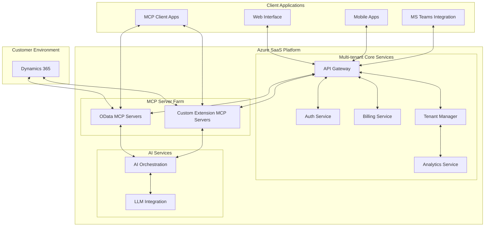
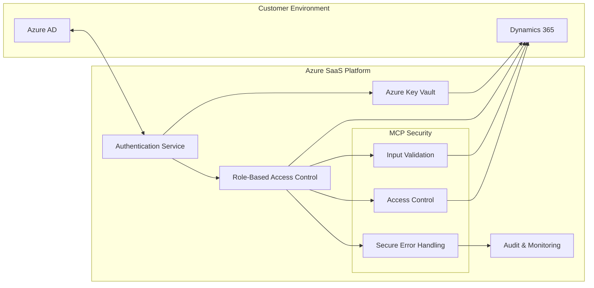

# Product Vision

## Core Functionality and Features

The D365-MCP solution provides an AI interface to Dynamics 365 business applications through these core capabilities:

1. **Natural Language Interaction**: Enables users to query business data, execute operations, and receive insights using conversational language
2. **Cross-module Data Access**: Provides unified access to data across different Dynamics 365 modules
3. **Process Automation**: Automates multi-step business processes through AI-orchestrated workflows
4. **Intelligent Insights**: Generates recommendations and analysis based on business data patterns
5. **Custom Extension Framework**: Allows partners and customers to develop specialized capabilities

## Technology Stack and Architecture

### Layered Architecture

The solution follows a layered architecture:



### Key Components

1. **Multi-tenant Core Services**
   - API Gateway: Central access point for all client applications
   - Auth Service: Handles authentication and authorization
   - Tenant Manager: Manages customer environments and configurations
   - Billing Service: Handles subscription management and usage tracking
   - Analytics Service: Monitors usage patterns and performance

2. **MCP Server Farm**
   - OData MCP Servers: Connect to standard Dynamics OData endpoints
   - Custom Extension MCP Servers: Connect to custom Dynamics extensions

3. **AI Services**
   - LLM Integration: Connects to AI models (Claude, GPT-4, etc.)
   - AI Orchestration: Manages context, prompts, and tool invocation

4. **Client Applications**
   - Web Interface: Primary user interface
   - Mobile Apps: For on-the-go access
   - MS Teams Integration: Embedded experience in Teams
   - MCP Client Apps: Support for direct MCP client connections

### MCP Implementation Details

The Model Context Protocol (MCP) is implemented through specialized servers that expose Dynamics data and operations:

#### OData MCP Server

The OData MCP Server exposes Dynamics data through standardized tools:

```typescript
// Example tool definitions for Dynamics OData
{
  name: "query_entity",
  description: "Query a Dynamics entity set with OData parameters",
  inputSchema: {
    type: "object",
    properties: {
      entitySet: { type: "string" },
      queryParams: { 
        type: "object",
        properties: {
          $select: { type: "string" },
          $filter: { type: "string" },
          $expand: { type: "string" },
          $orderby: { type: "string" },
          $top: { type: "number" },
          $skip: { type: "number" }
        }
      }
    },
    required: ["entitySet"]
  }
}
```

#### Resource Templates

Resources provide direct access to Dynamics data:

```typescript
// Example resource templates for Dynamics data
{
  uriTemplate: "dynamics://{tenant}/{entity}",
  name: "Dynamics Entity",
  description: "Access to a Dynamics entity set"
}

{
  uriTemplate: "dynamics://{tenant}/{entity}/{id}",
  name: "Dynamics Record",
  description: "Access to a specific Dynamics record"
}
```

### Security Architecture



Key security features:

1. **Data Isolation**: Complete separation of customer data
2. **Credential Protection**: Secure storage in Azure Key Vault
3. **Least Privilege Access**: Minimal permissions for service principals
4. **MCP Security Controls**: Input validation, access control, and secure error handling
5. **Comprehensive Auditing**: Full logging of all operations
6. **Compliance**: Adherence to Microsoft compliance frameworks

## Agent Development Framework

The platform includes a comprehensive framework for building AI agents:

```mermaid
flowchart TB
    subgraph "Agent Framework Components"
        CoreRuntime["Agent Runtime Core"]
        PromptLib["Prompt Library"]
        ToolRegistry["Tool Registry"]
        MemoryMgr["Memory Manager"]
        Orchestrator["Orchestration Engine"]
        AuthZ["Authorization Manager"]
    end
    
    subgraph "Developer Experience"
        VisualBuilder["Visual Agent Builder"]
        CodeSDK["Code-based SDK"]
        TestingSuite["Agent Testing Suite"]
        Simulator["Interaction Simulator"]
        Metrics["Performance Analytics"]
    end
    
    subgraph "Runtime Components"
        LLMServices["LLM Services"]
        DataConnectors["Data Connectors"]
        CustomTools["Custom Tool Integration"]
        AgentContext["Context Management"]
        Logging["Observability & Logging"]
    end
    
    CoreRuntime --> PromptLib
    CoreRuntime --> ToolRegistry
    CoreRuntime --> MemoryMgr
    CoreRuntime --> Orchestrator
    CoreRuntime --> AuthZ
    
    VisualBuilder --> CoreRuntime
    CodeSDK --> CoreRuntime
    TestingSuite --> CoreRuntime
    Simulator --> CoreRuntime
    CoreRuntime --> Metrics
    
    CoreRuntime <--> LLMServices
    CoreRuntime <--> DataConnectors
    CoreRuntime <--> CustomTools
    CoreRuntime <--> AgentContext
    CoreRuntime <--> Logging
```



### Agent Types and Templates

1. **Process Agents**: Quote generation, order processing, approval workflows
2. **Advisory Agents**: Sales coaching, financial analysis, recommendation agents
3. **Data Analysis Agents**: Anomaly detection, forecasting, reporting agents
4. **Customer-Facing Agents**: Customer support, product information, appointment scheduling

## Product Roadmap

### Phase 1: Foundation (Months 1-3)
- Set up Azure infrastructure for multi-tenant SaaS
- Develop core OData MCP server
- Implement tenant management and security
- Create basic web interface

### Phase 2: Enhanced Capabilities (Months 4-6)
- Implement AI orchestration layer
- Develop analytics and monitoring
- Create billing and subscription management
- Build Teams integration

### Phase 3: Custom Extensions (Months 7-9)
- Develop framework for custom Dynamics extensions
- Create sample extension packages
- Implement extension marketplace
- Enhance AI capabilities with specialized models

### Phase 4: Enterprise Features (Months 10-12)
- Implement enterprise security features
- Add compliance certifications
- Develop advanced analytics
- Create partner program for extensions

## Technical Requirements

### Azure Resources
- Azure App Service (or AKS for larger deployments)
- Azure SQL Database
- Azure Key Vault
- Azure AD B2C
- Azure Functions
- Azure Monitor
- Azure Logic Apps
- Azure API Management
- Azure OpenAI Service (for platform-provided LLM)
- Azure Machine Learning (for custom model deployment)
- Azure Cognitive Services (for specialized AI capabilities)
- Azure Cosmos DB (for conversation and agent state storage)

### LLM Integration Options

1. **Platform-Provided LLM Services**
   - Azure OpenAI Service Integration (GPT-4, GPT-3.5 Turbo)
   - Embeddings models for semantic search
   - Custom-tuned models for Dynamics terminology

2. **Bring Your Own Model**
   - Third-party LLM Integration (Anthropic Claude, open-source models)
   - Enterprise custom model support
   - Private model deployment in customer environment
