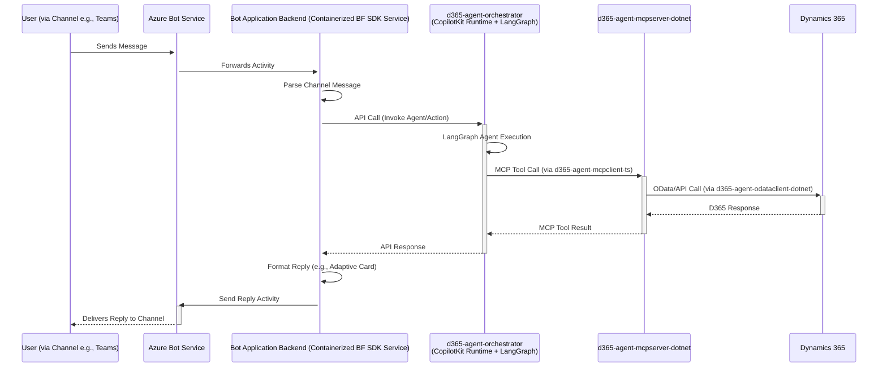

# Integration: Microsoft Bot Framework

The **Microsoft Bot Framework** provides a comprehensive platform for building, connecting, deploying, and managing enterprise-grade conversational AI experiences across various channels. Integrating with Bot Framework allows users to interact with the Dynamics 365 AI Agent system through familiar interfaces like Microsoft Teams or embedded web chat.

The core intelligence and business process orchestration for the D365 AI Agent system reside in the **`d365-agent-orchestrator`** (hosting CopilotKit Runtime and LangGraph agents). A Bot Framework bot will act as a channel-specific adapter or bridge to this orchestrator.

## Role in Architecture

*   **Presentation Layer / Channel Adapter:** The Bot Framework bot serves as an adapter for specific channels like Microsoft Teams or Web Chat.
*   **Bridge to Orchestrator:** Its primary role is to receive user messages from a channel, relay them to the `d365-agent-orchestrator` for processing by LangGraph agents, and then present the responses back to the user on the channel.

## Key Components

*   **SDK Source Code:** The Bot Framework SDKs for C# ([`microsoft/botbuilder-dotnet`](https://github.com/microsoft/botbuilder-dotnet)) and JavaScript/TypeScript ([`microsoft/botbuilder-js`](https://github.com/microsoft/botbuilder-js)) are used to build the bot application.
*   **Core Components:**
    *   **Channels:** User interacts via a Bot Framework supported channel (e.g., Teams, Web Chat).
    *   **Azure Bot Service:** Relays messages between the channel and the bot's backend.
    *   **Bot Application Backend (Containerized Service):**
        *   This is a custom-built service using the Bot Framework SDK. It should be **containerized** and deployed (e.g., to Azure Container Apps).
        *   It receives incoming activities (messages, events) from Azure Bot Service.
        *   It handles channel-specific message formatting and user interaction elements (like Adaptive Cards in Teams).
        *   **Crucially, it makes API calls to the `d365-agent-orchestrator`** to trigger LangGraph agents or simpler actions for processing the user's request and interacting with Dynamics 365 (via the D365 MCP Server).
        *   It receives responses from `d365-agent-orchestrator` and formats them for the channel.

## Integration Flow

1.  User sends a message via a channel (e.g., Teams).
2.  Azure Bot Service routes the activity to the Bot Application Backend's messaging endpoint.
3.  The Bot Application Backend (containerized service built with Bot Framework SDK) receives the activity.
4.  It may perform initial parsing or NLU to determine user intent or extract key entities relevant for the channel.
5.  The Bot Application Backend makes an API call to the **`d365-agent-orchestrator`**, passing the user's request and any relevant context.
6.  The **`d365-agent-orchestrator`** (hosting CopilotKit Runtime and LangGraph agents):
    *   The CopilotKit Runtime may involve an LLM to further refine intent or select a LangGraph agent.
    *   The appropriate LangGraph agent (e.g., Purchase Agent, Sales Agent) is invoked.
    *   The LangGraph agent executes its state machine, which may involve:
        *   Calling OpenAI for document parsing (if applicable).
        *   Using `d365-agent-mcpclient-ts` to call tools on the `d365-agent-mcpserver-dotnet` for D365 operations.
7.  The LangGraph agent returns a result (or streams updates) to the CopilotKit Runtime, which then responds to the API call from the Bot Application Backend.
8.  The Bot Application Backend receives the response from `d365-agent-orchestrator`.
9.  It formats this response into a user-friendly message for the specific channel (e.g., text, Adaptive Card for Teams).
10. The Bot Application Backend sends the response activity back to the user via Azure Bot Service and the channel.

## Strengths
*   **Multi-Channel Reach:** Leverage Bot Framework's extensive channel support.
*   **Enterprise Features:** Utilizes Azure Bot Service for scalability, management, and integration with services like Azure AD for authentication.
*   **Rich Channel-Specific UI:** Supports features like Adaptive Cards in Teams for structured interactions.

## Considerations
*   **Bot Backend as a Bridge:** The Bot Framework application backend is primarily an adapter. The core business logic and orchestration reside in `d365-agent-orchestrator`.
*   **Authentication:** The Bot Framework application must securely communicate with `d365-agent-orchestrator`. User identity from the channel might need to be passed to the orchestrator for context or authorization.
*   **State Management:**
    *   Conversation state specific to the Bot Framework channel (e.g., dialog state) is managed by the Bot Application Backend.
    *   Business process state (e.g., PO processing status) is managed by the LangGraph agent within `d365-agent-orchestrator`. These might need to be correlated if complex interactions span both.
*   **Message Formatting:** The Bot Application Backend is responsible for translating structured data from `d365-agent-orchestrator` into channel-appropriate formats.
