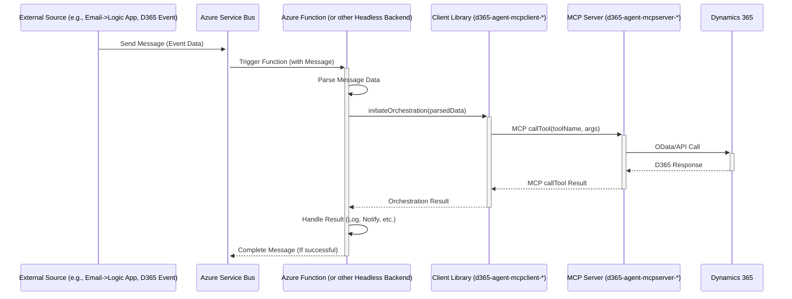

# Headless Integrations

This pattern applies to scenarios where there is no direct user interface involved in triggering the D365 AI Agent system. Instead, the process is initiated by an event or data arriving through a non-interactive channel.

*   **Role:** Automates D365 processes based on system events or data inputs without direct human interaction at the point of initiation.
*   **Triggering Mechanisms:**
    *   **Email:** An Azure Logic App or Power Automate flow monitors an inbox.
    *   **File Drop:** An Azure Logic App or Event Grid subscription reacts to files (e.g., CSV, XML, PDF) being uploaded to Azure Blob Storage or a specific folder.
    *   **System Events:** D365 Business Events, external system webhooks, or messages arriving on Azure Service Bus / Event Hubs.
    *   **Scheduled Tasks:** An Azure Function Timer Trigger or scheduled job initiates a process.
*   **Integration Service as Application Backend:** The service that handles the trigger effectively acts as the **Application Backend**. This could be:
    *   **Azure Logic App / Power Automate:** For simpler workflows, potentially calling an Azure Function for more complex orchestration.
    *   **Azure Function:** Triggered directly (e.g., by Service Bus, Event Grid, Timer) or called by a Logic App.
    *   **Custom Service/Daemon:** A continuously running service monitoring a queue or external source.
*   **Integration Point:** The integration service (Logic App, Function, etc.) uses the appropriate **`d365-agent-mcpclient-*`** library (or makes direct HTTP calls to an Application Backend API that uses the library) to:
    1.  Receive the triggering data/event.
    2.  Extract necessary information.
    3.  Initiate the relevant orchestration flow (AutoGen/DAG) defined within the client library.
    4.  The orchestration logic calls MCP tools on the deployed `d365-agent-mcpserver-*`.
    5.  Handles results, including potential error logging or triggering follow-up actions (e.g., sending a notification email, writing to a status log).

## Interaction Flow Example (Service Bus Trigger)

*   **Use Cases:**
    *   Processing emailed purchase orders automatically.
    *   Bulk-importing data from uploaded files.
    *   Automated system-to-system integrations triggered by events.
    *   Scheduled data synchronization or reporting tasks.

*   **Considerations:** Requires careful design of error handling and monitoring, as there is no user immediately present to resolve issues. Logging and alerting become critical. Clear definition of the triggering event and data payload is essential.
