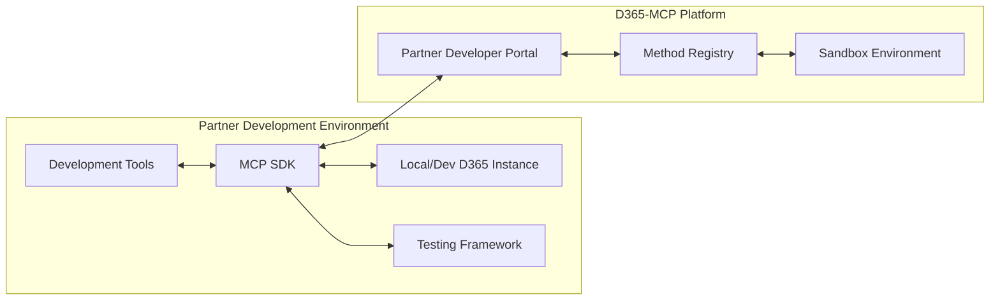

# Partner Guide: Registering Customer-Specific Custom MCP Methods
## Implementation Guide for D365-MCP Partner Ecosystem

## Overview

This document outlines the process for partners to develop, register, and deploy customer-specific custom MCP methods within the d365-mcp platform. Custom methods allow partners to extend the platform's capabilities to address unique customer requirements, industry-specific workflows, or specialized integrations beyond the standard OData interactions.

---

## Custom MCP Method Development Process

### 1. Development Environment Setup

Partners need to establish a proper development environment to create custom MCP methods:



#### Prerequisites:

1. **Partner Developer Account**: Register on the d365-mcp Partner Portal to obtain developer credentials.
2. **MCP Server SDK**: Install the MCP Server SDK for developing custom method implementations.
3. **Local Development Environment**:
   - Node.js (v16+)
   - TypeScript
   - Docker (for containerized testing)
   - Git
4. **D365 Development Instance**: Access to a development Dynamics 365 instance for testing.

#### Development Tools Installation:

```bash
# Install MCP Server SDK
npm install @d365-mcp/server-sdk

# Install CLI tools
npm install -g @d365-mcp/cli

# Initialize a new MCP server project
mcp-cli init custom-methods-server

# Navigate to project directory
cd custom-methods-server

# Install dependencies
npm install
```

### 2. Custom Method Implementation

#### Method Definition Structure:

Custom methods follow a standardized definition structure that includes metadata and implementation logic:

```typescript
import { 
  createMethod, 
  MethodContext, 
  MethodResponse 
} from '@d365-mcp/server-sdk';

// Method definition
export const customerSpecificMethod = createMethod({
  // Metadata
  name: 'customer_specific_method',
  displayName: 'Customer-Specific Method',
  description: 'Performs a specialized operation for Customer X',
  customerTenantId: 'customer-x-tenant-id', // Optional: restrict to specific tenant
  
  // Input schema using JSON Schema format
  inputSchema: {
    type: 'object',
    properties: {
      parameter1: {
        type: 'string',
        description: 'Description of parameter 1'
      },
      parameter2: {
        type: 'number',
        description: 'Description of parameter 2'
      }
    },
    required: ['parameter1']
  },
  
  // Implementation function
  async execute(context: MethodContext, input: any): Promise<MethodResponse> {
    // Access D365 data
    const dynamicsClient = context.getClient('dynamics');
    
    try {
      // Implementation logic
      const result = await dynamicsClient.entities('account')
        .filter(`name eq '${input.parameter1}'`)
        .select('accountid,name,revenue')
        .get();
      
      // Custom business logic
      const processedResult = customBusinessLogic(result, input.parameter2);
      
      // Return successful response
      return {
        status: 'success',
        data: processedResult,
        metadata: {
          processingTime: context.metrics.executionTime,
          recordCount: processedResult.length
        }
      };
    } catch (error) {
      // Error handling
      context.logger.error('Error executing custom method', error);
      
      return {
        status: 'error',
        error: {
          code: 'EXECUTION_ERROR',
          message: error.message,
          details: error.stack
        }
      };
    }
  }
});

// Helper function for business logic
function customBusinessLogic(data, parameter) {
  // Custom logic implementation
  return data.map(item => {
    // Transform or enhance data
    return {
      ...item,
      calculated_value: item.revenue * parameter
    };
  });
}
```

#### Security Considerations:

1. **Input Validation**: Always validate all input parameters to prevent injection attacks.
2. **Authorization Checks**: Implement authorization checks within custom methods.
3. **Error Handling**: Implement proper error handling to avoid leaking sensitive information.
4. **Logging**: Use the provided logging framework to track method execution.
5. **Secrets Management**: Never hardcode credentials; use the platform's secret management.

### 3. Testing Custom Methods

Testing custom methods involves multiple levels of validation:

#### Local Testing:

```typescript
// test/customer-specific-method.test.ts
import { createTestContext } from '@d365-mcp/server-sdk/testing';
import { customerSpecificMethod } from '../src/methods/customer-specific-method';

describe('Customer Specific Method', () => {
  it('should process data correctly', async () => {
    // Create test context with mocked D365 client
    const context = createTestContext({
      mockDynamicsClient: {
        entities: jest.fn().mockReturnValue({
          filter: jest.fn().mockReturnThis(),
          select: jest.fn().mockReturnThis(),
          get: jest.fn().mockResolvedValue([
            { accountid: '123', name: 'Test Account', revenue: 100000 }
          ])
        })
      }
    });
    
    // Execute method with test input
    const result = await customerSpecificMethod.execute(context, {
      parameter1: 'Test Account',
      parameter2: 1.5
    });
    
    // Assertions
    expect(result.status).toBe('success');
    expect(result.data[0].calculated_value).toBe(150000);
  });
  
  it('should handle errors appropriately', async () => {
    // Create test context with failing mock
    const context = createTestContext({
      mockDynamicsClient: {
        entities: jest.fn().mockReturnValue({
          filter: jest.fn().mockReturnThis(),
          select: jest.fn().mockReturnThis(),
          get: jest.fn().mockRejectedValue(new Error('Network error'))
        })
      }
    });
    
    // Execute method with test input
    const result = await customerSpecificMethod.execute(context, {
      parameter1: 'Test Account',
      parameter2: 1.5
    });
    
    // Assertions
    expect(result.status).toBe('error');
    expect(result.error.code).toBe('EXECUTION_ERROR');
  });
});
```

#### Sandbox Testing:

After local testing, methods should be tested in the platform sandbox:

```bash
# Deploy to sandbox for testing
mcp-cli deploy --environment sandbox --server-package ./dist/server.js
```

### 4. Method Registration

Once the custom method is developed and tested, it needs to be registered with the platform:

#### Method Registration Process:

1. **Package the Custom Method**:
   ```bash
   # Build the package
   npm run build
   
   # Package for deployment
   mcp-cli package --output ./custom-method-package.zip
   ```

2. **Register via Partner Portal or API**:
   - Upload package through Partner Portal UI
   - Or use the Registration API:
   ```typescript
   // Registration via API
   import { registerCustomMethod } from '@d365-mcp/partner-api';
   
   async function registerMethod() {
     const registrationResult = await registerCustomMethod({
       packagePath: './custom-method-package.zip',
       partnerApiKey: 'your-partner-api-key',
       customerTenantId: 'customer-tenant-id',
       description: 'Production implementation of Customer X custom method',
       version: '1.0.0',
       settings: {
         maxConcurrentExecutions: 10,
         timeoutSeconds: 30,
         allowedRoles: ['System Administrator', 'Custom Role X']
       }
     });
     
     console.log('Registration ID:', registrationResult.registrationId);
     console.log('Status:', registrationResult.status);
   }
   
   registerMethod().catch(console.error);
   ```

3. **Approval Workflow**:
   - Platform administrators review the submission
   - Security scanning is performed on the code
   - Test executions are run in an isolated environment
   - Approval or rejection with feedback

#### Method Versioning:

Methods should follow semantic versioning practices:

- **Major Version**: Breaking changes to the interface
- **Minor Version**: Functionality additions (non-breaking)
- **Patch Version**: Bug fixes and minor improvements

Multiple versions can be registered and active simultaneously to support gradual migration.

---

## Customer-Specific Deployment

### 1. Customer Tenant Association

Custom methods can be associated with specific customer tenants through two approaches:

#### Approach 1: During Registration

The `customerTenantId` parameter in the method definition or registration process explicitly associates the method with a specific customer tenant.

#### Approach 2: Multi-tenant with Runtime Filtering

Methods can be designed for multi-tenant use with runtime tenant filtering:

```typescript
export const multiTenantMethod = createMethod({
  name: 'multi_tenant_method',
  // Omit customerTenantId for multi-tenant capability
  
  async execute(context: MethodContext, input: any): Promise<MethodResponse> {
    // Get the current tenant ID
    const currentTenantId = context.tenant.id;
    
    // Tenant-specific customization logic
    let processingLogic;
    
    switch(currentTenantId) {
      case 'tenant-a':
        processingLogic = tenantAProcessing;
        break;
      case 'tenant-b':
        processingLogic = tenantBProcessing;
        break;
      default:
        processingLogic = defaultProcessing;
    }
    
    // Execute tenant-specific logic
    return processingLogic(context, input);
  }
});
```

### 2. Customer Environment Configuration

Each custom method may require specific configuration for the customer environment:

#### Environment-Specific Configuration:

```typescript
// Configuration schema
export const configSchema = {
  type: 'object',
  properties: {
    apiEndpoint: {
      type: 'string',
      description: 'Customer-specific API endpoint'
    },
    batchSize: {
      type: 'number',
      description: 'Batch size for processing',
      default: 100
    },
    enableHeavyProcessing: {
      type: 'boolean',
      description: 'Whether to enable resource-intensive processing',
      default: false
    }
  },
  required: ['apiEndpoint']
};
```

#### Configuration Management:

Partners can manage configuration through:

1. **Partner Portal**: UI-based configuration management
2. **Configuration API**: Programmatic configuration updates
3. **Customer Admin Portal**: Delegated configuration options for customers

```typescript
// Example configuration API usage
import { updateMethodConfiguration } from '@d365-mcp/partner-api';

async function updateConfig() {
  await updateMethodConfiguration({
    methodId: 'method-registration-id',
    customerTenantId: 'customer-tenant-id',
    configuration: {
      apiEndpoint: 'https://customer-api.example.com/v2',
      batchSize: 200,
      enableHeavyProcessing: true
    }
  });
}
```

### 3. Access Control and Permissions

Custom methods can have granular access control:

#### Role-Based Access Control:

```typescript
// Method with role-based access
export const restrictedMethod = createMethod({
  name: 'restricted_method',
  displayName: 'Restricted Method',
  
  // Specify allowed roles
  accessControl: {
    roles: ['System Administrator', 'Finance Manager'],
    // Optional custom authorization function
    customAuthorization: async (context, input) => {
      // Custom authorization logic
      if (input.amount > 10000 && !context.user.roles.includes('Senior Manager')) {
        return {
          authorized: false,
          reason: 'Amounts over 10,000 require Senior Manager role'
        };
      }
      return { authorized: true };
    }
  },
  
  // Method implementation
  async execute(context, input) {
    // Method logic
  }
});
```

#### Data-Level Security:

Custom methods should respect D365's data-level security:

```typescript
// Respecting D365 security
async function respectedSecuredData(context, filter) {
  // Use the authenticated user's context for queries
  // This ensures D365's security model applies
  const secureClient = context.getClient('dynamics', { useCallerIdentity: true });
  
  return secureClient.entities('opportunity')
    .filter(filter)
    .get();
}
```

---

## Monitoring and Management

### 1. Execution Monitoring

Partners can monitor the execution of custom methods through:

#### Performance Dashboard:

The Partner Portal provides a performance dashboard showing:
- Execution counts and success rates
- Average execution time
- Error rates and common error types
- Resource utilization

#### Logging and Diagnostics:

```typescript
// Custom method with detailed logging
async function methodWithLogging(context, input) {
  // Start logging with correlation ID
  context.logger.info('Starting method execution', {
    correlationId: context.correlationId,
    parameters: {
      // Log sanitized inputs (no sensitive data)
      entityType: input.entityType,
      operation: input.operation
    }
  });
  
  try {
    // Method implementation
    const result = await performOperation(context, input);
    
    // Log success
    context.logger.info('Method executed successfully', {
      correlationId: context.correlationId,
      metrics: {
        recordsProcessed: result.length,
        executionTimeMs: context.metrics.executionTime
      }
    });
    
    return result;
  } catch (error) {
    // Log error
    context.logger.error('Method execution failed', {
      correlationId: context.correlationId,
      errorType: error.name,
      errorMessage: error.message,
      // Include stack trace in development, not production
      stack: context.environment === 'development' ? error.stack : undefined
    });
    
    throw error;
  }
}
```

#### Alerting:

Partners can configure alerts based on:
- Error rate thresholds
- Performance degradation
- Usage patterns
- Security events

### 2. Lifecycle Management

Custom methods have a defined lifecycle that partners need to manage:

#### Method Lifecycle Stages:

1. **Development**: Initial creation and testing
2. **Staging**: Pre-production validation
3. **Production**: Active use in production
4. **Maintenance**: Bug fixes and minor updates
5. **Deprecation**: Planned discontinuation
6. **Decommissioning**: Removal from production

#### Version Management:

```typescript
// Semantic versioning in method definition
export const versionedMethod = createMethod({
  name: 'customer_data_processor',
  version: '2.1.0', // Major.Minor.Patch
  
  // Optional deprecation notice
  deprecation: {
    deprecated: false,
    plannedDeprecationDate: '2025-12-31',
    replacementMethod: 'customer_data_processor_v3',
    message: 'This method will be replaced by the v3 version with enhanced capabilities.'
  },
  
  // Method implementation
  async execute(context, input) {
    // Implementation that matches the semantic version
  }
});
```

#### Deployment Strategies:

1. **Blue-Green Deployment**: Maintain two identical environments and switch between them
2. **Canary Release**: Gradual rollout to a subset of users
3. **Feature Flags**: Conditionally enable functionality based on configuration

```typescript
// Feature flag implementation
async function methodWithFeatureFlags(context, input) {
  // Get feature flags
  const flags = await context.getFeatureFlags('customer-data-processor');
  
  // Base implementation
  let result = await baseImplementation(context, input);
  
  // Optional enhanced processing if flag enabled
  if (flags.enableEnhancedProcessing) {
    result = await enhancedProcessing(result, flags.processingOptions);
  }
  
  // Optional new output format if flag enabled
  if (flags.useNewOutputFormat) {
    result = transformToNewFormat(result);
  }
  
  return result;
}
```

---

## Handling Updates and Changes

### 1. API Changes and Compatibility

Partners need strategies for handling D365 API changes:

#### Abstraction Layers:

```typescript
// Abstraction layer for D365 interaction
class CustomerRepository {
  constructor(private context: MethodContext) {}
  
  // Abstract D365 API interaction
  async getCustomerById(id: string) {
    const client = this.context.getClient('dynamics');
    
    // Try current API approach
    try {
      return await client.entities('account')
        .filter(`accountid eq '${id}'`)
        .select('accountid,name,telephone1,emailaddress1')
        .get();
    } catch (error) {
      // Fall back to alternative if API changed
      if (error.code === 'ENTITY_NOT_FOUND' || error.code === 'PROPERTY_NOT_FOUND') {
        // Try alternative (e.g., if entity name changed)
        return await client.entities('contact')
          .filter(`contactid eq '${id}'`)
          .select('contactid,fullname,telephone1,emailaddress1')
          .get();
      }
      throw error;
    }
  }
}
```

#### Version Check Patterns:

```typescript
// Version-aware implementation
async function versionAwareMethod(context, input) {
  // Get D365 version info
  const versionInfo = await context.getDynamicsVersion();
  
  // Select implementation based on version
  if (versionInfo.isAtLeast('9.2')) {
    return modernImplementation(context, input);
  } else {
    return legacyImplementation(context, input);
  }
}
```

### 2. Method Updates and Versioning

When updating custom methods, consider these approaches:

#### Non-breaking Updates:

For backwards-compatible changes:
1. Increment minor or patch version
2. Deploy updated method
3. Existing references continue to work

#### Breaking Changes:

For breaking changes:
1. Create new method with incremented major version
2. Register both versions
3. Inform customers of migration timeline
4. Deprecate old version after transition period

#### Deprecation Process:

```typescript
// Deprecation notice in method update
export const deprecatedMethod = createMethod({
  name: 'legacy_process',
  version: '1.5.2',
  
  deprecation: {
    deprecated: true,
    deprecationDate: '2024-06-15',
    sunsetDate: '2025-06-15',
    replacementMethod: 'modern_process',
    message: 'This method is deprecated and will be removed on 2025-06-15. Please migrate to modern_process.'
  },
  
  async execute(context, input) {
    // Log deprecation warning
    context.logger.warn('Using deprecated method', {
      method: 'legacy_process',
      replacementMethod: 'modern_process',
      sunsetDate: '2025-06-15'
    });
    
    // Continue with implementation
    return legacyImplementation(context, input);
  }
});
```

---

## Integration with D365-MCP Ecosystem

### 1. Method Discovery and Documentation

Custom methods need to be discoverable and well-documented:

#### Auto-generated Documentation:

The platform generates method documentation from:
- Method metadata
- Input/output schemas
- Code comments
- Usage examples

#### Partner-provided Documentation:

Partners should provide:
- Usage guidelines
- Contextual examples
- Best practices
- Troubleshooting guides

#### Documentation Format:

```markdown
# Customer Data Processor Method

## Overview
Processes customer data with specialized business rules for Customer X.

## Input Parameters
| Parameter | Type | Required | Description |
|-----------|------|----------|-------------|
| customerId | string | Yes | The D365 Account ID of the customer |
| processType | string | Yes | Type of processing: 'standard', 'premium', or 'custom' |
| options | object | No | Additional processing options |

## Example Usage
```typescript
const result = await mcpClient.callMethod('customer_data_processor', {
  customerId: '5F4B24C1-9EF0-4E3B-99D2-7B9F8E32198A',
  processType: 'premium',
  options: {
    includeInactiveRecords: true,
    processingLevel: 'detailed'
  }
});
```

## Output
The method returns processed customer data with enhancement scores and recommendations.

## Error Codes
| Code | Description | Resolution |
|------|-------------|------------|
| CUSTOMER_NOT_FOUND | Customer ID not found | Verify the customer ID exists |
| INVALID_PROCESS_TYPE | Process type not recognized | Use one of the supported types |
```

### 2. Integration with Standard Methods

Custom methods can be integrated with standard platform methods:

#### Method Chaining Pattern:

```typescript
// Standard method that can incorporate custom methods
export const standardMethod = createMethod({
  name: 'standard_data_processor',
  
  async execute(context, input) {
    // Standard processing
    const standardResult = await standardProcessing(context, input);
    
    // Check if customer has custom processing registered
    const customerTenantId = context.tenant.id;
    const customMethods = await context.getRegisteredMethods(customerTenantId);
    
    // If custom method exists, call it for enhanced processing
    if (customMethods.includes('customer_specific_processor')) {
      try {
        // Call the custom method
        return await context.callMethod('customer_specific_processor', {
          standardResult,
          additionalContext: input.context
        });
      } catch (error) {
        // Fall back to standard result if custom processing fails
        context.logger.error('Custom processing failed, using standard result', error);
        return standardResult;
      }
    }
    
    // Return standard result if no custom processing
    return standardResult;
  }
});
```

#### Extension Point Pattern:

```typescript
// Method with explicit extension points
export const extensibleMethod = createMethod({
  name: 'extensible_workflow',
  
  async execute(context, input) {
    // Pre-processing extension point
    const preProcessResult = await callExtensionPoint(
      context, 
      'extensible_workflow.pre_process',
      input
    );
    
    // Core processing with extension result
    const processResult = await coreProcessing(
      context,
      preProcessResult || input
    );
    
    // Post-processing extension point
    const postProcessResult = await callExtensionPoint(
      context,
      'extensible_workflow.post_process',
      processResult
    );
    
    // Return final result
    return postProcessResult || processResult;
  }
});

// Helper to call extension points
async function callExtensionPoint(context, extensionPointId, data) {
  const extensions = await context.getRegisteredExtensions(extensionPointId);
  
  // If no extensions registered, return null to use original data
  if (!extensions || extensions.length === 0) {
    return null;
  }
  
  // Call each extension in sequence
  let currentData = data;
  
  for (const extension of extensions) {
    try {
      const extensionResult = await context.callMethod(extension, {
        data: currentData,
        extensionPoint: extensionPointId
      });
      
      // Update data for next extension
      currentData = extensionResult;
    } catch (error) {
      // Log error but continue with current data
      context.logger.error(`Extension ${extension} failed`, error);
    }
  }
  
  return currentData;
}
```

---

## Security and Compliance

### 1. Security Requirements

Custom methods must adhere to platform security requirements:

#### Code Scanning and Validation:

All submitted methods undergo:
- Static code analysis for vulnerabilities
- Dependency scanning for known issues
- Input/output validation checks
- Performance impact assessment

#### Security Best Practices:

1. **Input Validation**: Validate all user inputs
2. **Query Protection**: Use parameterized queries to prevent injection
3. **Authentication**: Always verify authentication before processing
4. **Authorization**: Check permissions for each operation
5. **Data Minimization**: Process only needed data
6. **Error Handling**: Avoid leaking sensitive details in errors
7. **Cryptographic Security**: Use platform cryptography services
8. **Logging**: Implement appropriate security event logging

### 2. Compliance Considerations

Methods handling sensitive data have additional requirements:

#### Data Privacy:

```typescript
// Method with data privacy controls
export const privacySensitiveMethod = createMethod({
  name: 'customer_profile_analyzer',
  
  // Data privacy declaration
  dataPrivacy: {
    processesPersonalData: true,
    dataCategories: ['contact_info', 'financial_data'],
    dataRetentionPeriod: '30d', // 30 days
    dataSubjectRights: {
      accessSupported: true,
      deleteSupported: true,
      rectifySupported: true
    }
  },
  
  // Implementation with privacy controls
  async execute(context, input) {
    // Check consent
    const consent = await context.getDataSubjectConsent(input.customerId);
    
    if (!consent.hasConsent('profile_analysis')) {
      return {
        status: 'error',
        error: {
          code: 'CONSENT_REQUIRED',
          message: 'Customer has not provided consent for profile analysis'
        }
      };
    }
    
    // Process with privacy controls
    const result = await privacyAwareProcessing(context, input);
    
    // Log for auditability
    await context.logPrivacyEvent({
      eventType: 'data_processing',
      dataSubjectId: input.customerId,
      operation: 'profile_analysis',
      dataCategories: ['contact_info', 'financial_data'],
      purpose: 'customer_service_optimization',
      legalBasis: 'consent'
    });
    
    return result;
  }
});
```

#### Industry-Specific Compliance:

For methods in regulated industries:
1. **Healthcare**: HIPAA compliance requirements
2. **Financial Services**: SOX, PCI-DSS requirements
3. **Government**: FedRAMP and local regulations

---

## Partner Portal Integration

### 1. Method Registration in Partner Portal

Partners use the Portal for the full registration workflow:

#### Portal Registration Flow:

1. Log in to Partner Portal
2. Navigate to "Custom Methods" section
3. Click "Register New Method"
4. Upload method package or provide repository URL
5. Fill in method metadata
6. Select customer tenant(s)
7. Configure runtime settings
8. Submit for review
9. Track approval status
10. Receive notification upon approval

### 2. Method Analytics and Insights

The Partner Portal provides analytics on method usage:

#### Available Analytics:

1. **Usage Statistics**:
   - Execution count by time period
   - Average execution time
   - Error rate and types
   - Usage by customer tenant

2. **Performance Metrics**:
   - Response time distribution
   - Resource utilization
   - Throttling events
   - Cache hit/miss ratio

3. **Business Impact**:
   - Records processed
   - Business operations completed
   - Integration events triggered
   - Custom business KPIs

#### Analytics API:

```typescript
// Accessing analytics programmatically
import { getMethodAnalytics } from '@d365-mcp/partner-api';

async function retrieveAnalytics() {
  const analytics = await getMethodAnalytics({
    methodId: 'custom-method-id',
    timeRange: {
      start: '2025-01-01T00:00:00Z',
      end: '2025-02-01T00:00:00Z'
    },
    metrics: ['execution_count', 'average_duration', 'error_rate'],
    groupBy: ['tenant_id', 'day']
  });
  
  console.log('Method Analytics:', analytics);
  
  // Process or visualize the analytics data
  generateReports(analytics);
}
```

---

## Troubleshooting and Support

### 1. Common Issues and Solutions

#### Method Registration Issues:

| Issue | Possible Causes | Solution |
|-------|----------------|----------|
| Registration Failure | Missing required fields | Check method metadata completeness |
| Validation Error | Code quality issues | Review scanning results and fix issues |
| Approval Rejection | Security concerns | Address security review feedback |
| Version Conflict | Existing version | Update version number according to semantic versioning |

#### Runtime Issues:

| Issue | Possible Causes | Solution |
|-------|----------------|----------|
| Timeout Error | Long-running operation | Optimize performance or increase timeout setting |
| Memory Error | Resource-intensive processing | Implement pagination or reduce batch size |
| Authentication Failure | Invalid credentials | Verify authentication configuration |
| Access Denied | Insufficient permissions | Check role assignments and requirements |

### 2. Support Resources

Partners have access to multiple support channels:

#### Support Options:

1. **Documentation**: Comprehensive documentation and knowledge base
2. **Community Forum**: Partner community for knowledge sharing
3. **Support Ticket System**: Direct support for critical issues
4. **Developer Office Hours**: Regular sessions with platform engineers
5. **Partner Slack Channel**: Real-time collaboration with support team

#### Logging for Support:

```typescript
// Enhanced logging for supportability
async function supportableMethods(context, input) {
  // Create support reference ID
  const supportRefId = context.createSupportReference();
  
  // Log with support reference
  context.logger.info('Method execution started', {
    supportReference: supportRefId,
    operation: 'customer_data_processing',
    parameters: sanitizeParameters(input)
  });
  
  try {
    // Method implementation
    const result = await implementation(context, input);
    
    // Log success with support reference
    context.logger.info('Method execution completed', {
      supportReference: supportRefId,
      outcome: 'success',
      resultStats: summarizeResults(result)
    });
    
    return {
      ...result,
      _supportReference: supportRefId // Include in response for support
    };
  } catch (error) {
    // Enhanced error logging for support
    context.logger.error('Method execution failed', {
      supportReference: supportRefId,
      errorType: error.name,
      errorMessage: error.message,
      errorStack: error.stack,
      errorContext: {
        state: context.getExecutionState(),
        input: sanitizeParameters(input)
      }
    });
    
    // Throw with support reference
    error.supportReference = supportRefId;
    throw error;
  }
}

// Helper to sanitize parameters for logging
function sanitizeParameters(params) {
  // Create copy to avoid modifying original
  const sanitized = {...params};
  
  // Remove sensitive fields
  const sensitiveFields = ['password', 'ssn', 'creditCard', 'apiKey'];
  for (const field of sensitiveFields) {
    if (field in sanitized) {
      sanitized[field] = '[REDACTED]';
    }
  }
  
  return sanitized;
}
```

---

## Best Practices and Patterns

### 1. Method Design Patterns

#### Batch Processing Pattern:

```typescript
// Batch processing for large datasets
export const batchProcessor = createMethod({
  name: 'batch_data_processor',
  
  async execute(context, input) {
    // Determine batch size
    const batchSize = input.batchSize || 100;
    const maxBatches = input.maxBatches || 10;
    
    // Initialize tracking
    let processedCount = 0;
    let currentBatch = 0;
    let hasMoreData = true;
    const results = [];
    
    //
